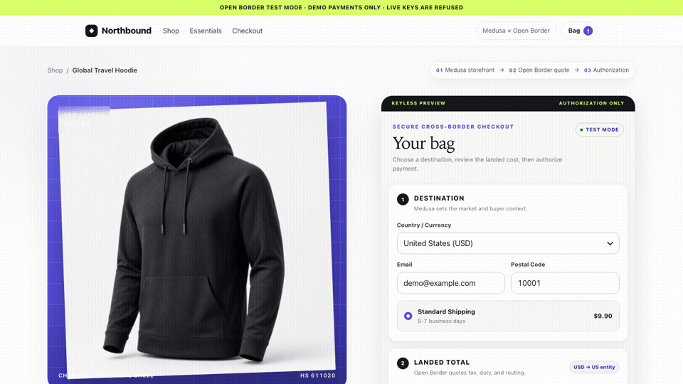
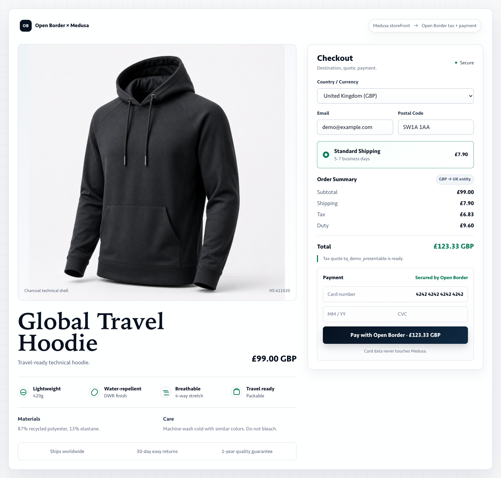
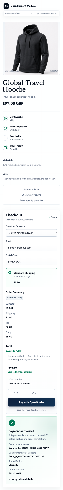

# Open Border × Medusa demo

A standalone checkout preview and provider adapter harness for the published
[`@open-border/medusa-payment-openborder`](https://www.npmjs.com/package/@open-border/medusa-payment-openborder)
package.

The demo shows how a Medusa-shaped cart can hand tax, duty, payment authorization, and entity
routing to Open Border. It consumes only public npm packages and does not require access to the
private Open Border monorepo.

> This repository is not a complete Medusa application. It does not start a Medusa backend or
> create a real Medusa order. The default preview uses clearly marked demo identifiers. Use the
> package registration example below inside a real Medusa v2 project.

## See the demo flow

The keyless preview starts with a US checkout, switches the destination and currency to the UK,
recalculates tax and duty, and finishes with a manual-capture payment authorization receipt.



<p align="center">
  
  
</p>

The full production Medusa application and account-backed configuration remain private. This
sanitized standalone demo, the published provider package, and the setup documentation are public.
All visuals above come from deterministic keyless preview data; they do not contain merchant
accounts, credentials, dashboard data, or real payment activity.

## What you can run safely

| Mode | Purpose | Credentials | Public hosting |
| --- | --- | --- | --- |
| Preview | Visual buyer-flow walkthrough | None | Yes, as static files |
| API-backed Test mode | Local adapter smoke against a supported Test API | Test keys only | No |
| Live mode | Real-money activity | Unsupported | No |

## Complete local demo walkthrough

Use the keyless preview first. It is the safest and most reliable presentation path because it
does not need credentials or create a Test transaction. If you also want to prove the adapter is
connected to Open Border, continue with the optional Test-mode walkthrough afterward.

### Before you start

You need Git, Node.js 20 or newer, and Corepack. Check Node.js with:

```bash
node --version
```

### Part 1: clone and run the keyless preview

1. Clone this public repository and enter its directory:

   ```bash
   git clone https://github.com/OpenBorder/openborder-medusa-demo.git
   cd openborder-medusa-demo
   ```

2. Enable Corepack and install the locked public dependencies:

   ```bash
   corepack enable
   pnpm install --frozen-lockfile
   ```

3. Start the demo:

   ```bash
   pnpm start
   ```

4. Open <http://127.0.0.1:8000>.

Preview mode is the default. It makes no Open Border API calls and uses deterministic demo quote
and authorization results.

### Part 2: present the keyless buyer flow

1. Show the **Global Travel Hoodie**.
2. Say: “Medusa owns the storefront and order flow. Open Border provides tax, duty, payment
   authorization, and entity routing.”
3. Change the market from **United States** to **United Kingdom**.
4. Point out the updated postal code, GBP amount, tax, duty, total, and UK routing label.
5. Select **Pay with Open Border**.
6. Show the demo order reference, demo Open Border payment-intent reference, routing label, and
   authorized total.
7. Say: “This preview stops at authorization. A real Medusa application decides when to capture
   or cancel the payment.”

Use the words **authorized**, not paid or captured. Call the order identifier a **demo order
reference**, because this repository does not create a real Medusa order.

## Build a static hosted preview

```bash
pnpm build:hosted-preview
```

Deploy only `dist/hosted-preview` to a static host. The generated artifact is keyless, does not
load the checkout SDK, performs no payment-network or `/api/demo/*` calls, and does not provide a
field for visitors to enter secret keys.

See [HOSTED_DEMO.md](./HOSTED_DEMO.md) for the deployment boundary.

## Optional connected Test-mode walkthrough

API-backed mode exercises the published Open Border tax and Medusa payment-provider adapters with
Medusa-shaped input. It creates activity only on the Test rail; it still does not run Medusa
itself or create a real Medusa order.

### Part 3: create a paired Test key

1. Open the [Open Border staging dashboard](https://staging.openborderpayments.com/).
2. Confirm that the environment selector at the top says **Test**. Do not use Production for this
   demo.
3. In the left navigation, open **Developers** and stay on the **API keys** tab.
4. In **Create API key**, select **Test**, enter a name such as `Medusa standup demo`, and select
   **Create key**.
5. Copy the secret key beginning with `sk_test_…` immediately. It is displayed only once.
6. Copy the matching publishable key beginning with `pk_test_…`.

Keep the secret key private. Do not paste it into source files, slides, chat, browser code, or a
screen-shared terminal.

### Part 4: configure the local Test adapter

1. Copy the environment template:

   ```bash
   cp .env.example .env
   ```

2. Open `.env` in a text editor and set:

   ```dotenv
   PORT=8000
   DEMO_MODE=api
   OPENBORDER_API_KEY=<paste your Test secret key here>
   OPENBORDER_PUBLISHABLE_KEY=<paste the matching Test publishable key here>
   ```

   Test keys automatically select the supported Test rail. Set `OPENBORDER_API_URL` only when the
   Open Border team asks you to override that default.

3. If the preview server is already running, stop it with <kbd>Ctrl</kbd>+<kbd>C</kbd>.
4. Start the local-only server again:

   ```bash
   pnpm start
   ```

5. Reopen <http://127.0.0.1:8000>.

The server binds to `127.0.0.1` and rejects live keys. Never deploy this Express server publicly
or expose `.env` while sharing your screen.

### Part 5: complete and verify the Test payment

1. Change the market to **United Kingdom** and wait for the tax-and-duty quote to update.
2. In the Open Border Test card field, enter:
   - Card number: `4242 4242 4242 4242`
   - Expiry: any future date
   - CVC: any valid three digits
3. Submit the payment.
4. Show the authorization receipt and Open Border payment-intent reference.
5. Optionally return to the staging dashboard, open **Transactions**, and use the reference to
   show the resulting Test activity.
6. Say: “This is connected to Open Border’s Test environment. It uses Test rails, so no real
   money moves.”

### Part 6: clean up after the presentation

1. Stop the local server with <kbd>Ctrl</kbd>+<kbd>C</kbd>.
2. If the key was created only for the presentation, return to **Developers → API keys**, locate
   `Medusa standup demo`, and select **Revoke**.
3. Keep `.env` local and uncommitted, or delete it when it is no longer needed.

Never use `sk_live_…` or `pk_live_…` credentials with this repository. Live mode is unsupported,
and the local server intentionally rejects live keys.

## Register the provider in a real Medusa v2 project

Install the public packages:

```bash
npm install @open-border/medusa-payment-openborder @open-border/js
```

Then register the provider in `medusa-config.ts`:

```ts
module.exports = {
  modules: [
    {
      resolve: '@medusajs/medusa/payment',
      options: {
        providers: [
          {
            resolve: '@open-border/medusa-payment-openborder/providers/openborder',
            id: 'openborder',
            options: {
              apiKey: process.env.OPENBORDER_API_KEY,
              baseUrl: process.env.OPENBORDER_API_URL,
            },
          },
        ],
      },
    },
  ],
};
```

The browser uses only the publishable key with `@open-border/js`. The Medusa server keeps the
secret key and sends the quote identifier, payment method, cart-derived line items, customer,
addresses, and a request idempotency key to the provider.

The provider creates a manual-capture payment intent. Medusa remains responsible for deciding
when to capture or cancel it. Persist the Open Border payment-intent ID beside the Medusa payment
or order reference for support and reconciliation.

## Repository map

- `public/` — storefront preview and checkout presentation
- `server.ts` — local preview server and optional Test-mode adapter harness
- `src/demo-catalog.ts` — demo product and market data
- `scripts/build-static-preview.ts` — produces the keyless static artifact
- `scripts/public-safety-check.mjs` — blocks private scopes, internal ticket references, internal
  staging URLs, and committed key-shaped secrets
- `DEMO.md` — short presenter script
- `SECURITY.md` — supported-use and reporting boundaries

## Verification

```bash
pnpm check
```

This runs the public-safety scan, TypeScript checks, and static preview build. CI repeats the same
checks after a clean frozen-lockfile install.

## Current limitations

- This repository demonstrates the checkout presentation and adapter contract, not a full Medusa
  backend/storefront deployment.
- Preview results and IDs are demo-only.
- API-backed mode is local and Test-only.
- Webhook reconciliation and asynchronous order recovery must be implemented by the real Medusa
  application.

## License and demo asset

Open Border has not yet selected an open-source license for this repository. Public visibility
does not grant a redistribution license beyond applicable law and GitHub's terms. The included
product image is demo imagery and contains content-provenance metadata. Contact Open Border before
redistributing the code or asset outside this repository.
